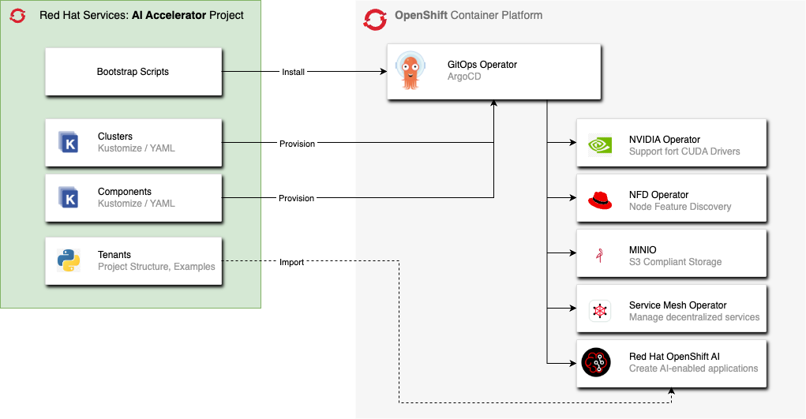

# Red Hat AI Accelerator

Welcome to the AI Accelerator project source code. This project is designed to initialize an OpenShift cluster with a recommended set of operators and components that aid with training, deploying, serving and monitoring Machine Learning models.

This repo is intended to provide a core set of OpenShift features that would commonly be used for a Data Science environment, but can also be highly customized for specific scenarios. When starting out we recommend making a copy or a fork of this project on your Git based instance, since it utilizes the process of automating IT infrastructure using infrastructure as code and software development best practices such as Git, code review, and CI/CD - known as GitOps.

Once the initial components are deployed, several ArgoCD Application objects are created which are then used to install and manage the install of the operators on the cluster.

## Additional Documentation and Info

* [Overview](documentation/overview.md) - what's inside this repository?
* [Installation Guide](documentation/installation.md) - containing step by step instructions for executing this installation sequence on your cluster

### Operators

* [Authorino Operator](components/operators/authorino-operator/)
* [NVIDIA GPU Operator](components/operators/gpu-operator-certified/)
* [Node Feature Discovery Operator](components/operators/nfd/)
* [OpenShift AI](components/operators/openshift-ai/)
* [OpenShift Pipelines](components/operators/openshift-pipelines/)
* [OpenShift Serverless](components/operators/openshift-serverless/)
* [OpenShift ServiceMesh](components/operators/openshift-servicemesh/)

### Applications

* OpenShift GitOps: [ArgoCD](components/argocd/)
* S3 compatible storage: [MinIO](components/apps/minio)

### Configuration

* [Bootstrap Overlays](bootstrap/overlays/)
* [Cluster Configuration Sets](clusters/overlays/)

### Tenants

* [Tenant Examples](tenants/)
