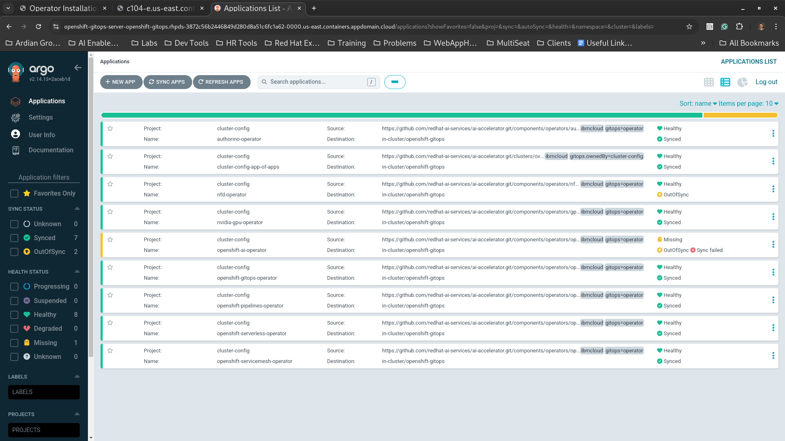

# rhoai-eus-2.16-ibmcloud-lab

## Prerequisites

1. Make sure you have admin access to ibmcloud and are logged in.
2. Make sure you have admin access to the ibmcloud openshift cluster and are logged in.

Disclaimer: This strategy was tested on a customer site, however due to lack of time and demand for the rhoai resources of the cluster, there was not further testing to ensure stable reproducibility of this solution. This is mainly to act as a starting point rather than a robust solution.

## Introduction

This bootstrap option was an attempt to adapt and configure ai-accelerator to deploy RHOAI (and related configurations) onto an Openshift cluster running on ibmcloud. Unfortunately, The ibmcloud instance of openshift is a managed service and thus certain controls are outside the control of an Openshift administrator especially in the case of deploying and configuring RedHat Openshift AI (Operator+Application) via OperatorHub and Subscriptions. Read more [here](https://cloud.ibm.com/docs/openshift?topic=openshift-overview#compare_ocp) and [here](https://cloud.ibm.com/docs/openshift?topic=openshift-ai-addon-install&interface=cli#ai-install-cli).

At the very least this bootstrap option will help one tweak (not installation!) the settings of an already installed RedHat Openshift AI   while allowing you to fully install related operators via Gitops.

Keep in mind the following:

* This bootstrap option used [rhoai-eus-2.16-aws-gpu](https://github.com/redhat-ai-services/ai-accelerator/tree/main/bootstrap/overlays/rhoai-eus-2.16-aws-gpu) as the starting point.
* All the overlay folders with "ibmcloud" in the name (such as bootstrap option folder name "rhoai-eus-2.16-ibmcloud-gpu") were chosen to indicate the related kustomizations.

In this directory you will find the starting or bootstrap `kustomization.yaml` file to be used by `bootstrap.sh` command at the root of the ai-accelerator project. This will allow us to stand up ArgoCD and tweak RHOAI on the ROKS cluster by a team member executing the `bootstrap.sh` command.

Below you will find key points that allowed us to bring ai-accelerator and ROKS into harmony:

### Getting over ROKS' ValidatingAdmissionsPolicy ''ibm-operators-subscriptions-policy''

If one tries to install Red Hat Openshift AI on a ROKS cluster of 4.16+ the conventional way (i.e. A Subscription that fetches content from Red Hat's out of the box catalog sources) then they will find the Subscription outputting the following error in its status object.
```
subscriptions.operators.coreos.com "rhods-operator" is forbidden: ValidatingAdmissionsPolicy ''ibm-operators-subscriptions-policy'' with binding
''ibm-operators-subscriptions-policy'' denied request: You must install rhods-operator as a managed Red Hat OpenShift on IBM Cloud add-on. 
See https://cloud.ibm.com/docs/openshift?topic=openshift-managed-addons for more information.
```

The reason for this is that ROKS has a particular way of installing RHOAI and prevents alternative installatioin methods. You can read more on installing rhoai through ibm clouds cli [here](https://cloud.ibm.com/docs/openshift?topic=openshift-ai-addon-install&interface=cli) and how to manage it thereafter [here](https://cloud.ibm.com/docs/openshift?topic=openshift-ai-addon-manage&interface=ui).

We can run the following modified steps for the initial bootstrapping:

1. Run this command so all catalog sources can communicate with the internet:
    ```
    $ ibmcloud oc vpc outbound-traffic-protection disable --cluster rhpds # replace rhpds with your ibm cluster name
    All outbound traffic from your cluster will be permitted. Do you want to continue? [y/N]> y
    OK
    ```
1. Make sure that all default catalog sources are turned on the ROKS cluster:
    ```
    $ oc patch operatorhub cluster --type json -p '[{"op": "add", "path": "/spec/disableAllDefaultSources", "value": false}]'
    operatorhub.config.openshift.io/cluster patched
    ```
1. All of the subscriptions can be installed cleanly with Openshift gitops except redhat openshift ai operator (Also odf operator but that isn't included in the ai-accelerator by default anyways). Also, the work done by the ibm cloud cli install method can't be converted to yaml. This means we are forced to use this cli command to install redhat openshift ai operator. Afterwards we can use Openshift Gitops as normal. 
*Note: Your usecase may be different so pay attention to the parameters being configured in this command. For example, you might not want the codeflare component set to managed or turned on as we did, etc*.
    ```
    $ ibmcloud oc cluster addon enable openshift-ai \
        --cluster rhpds \ 
        --param oaiInstallPlanApproval=Automatic \
        --param oaiCodeflare=Managed \
        --param oaiKserve=Managed \
        --param nvidiaCudaTest=true \
        --param pipelineEnabled=true \
        --param nvidiaEnabled=true \
        --param nfdEnabled=true # replace rhpds with your ibm cluster name

    Enabling add-on openshift-ai for cluster rhpds...
    The add-on might take several minutes to deploy and become ready for use.
    Using installation options...

    Add-on Options
    Option                             Value
    nvidiaCudaTest                     true
    oaiCodeflare                       Managed
    oaiRay                             Managed
    nfdEnabled                         true
    nvidiaSandboxDevicePluginEnabled   true
    nvidiaSandboxWorkloads             false
    nvidiaVfioManagerEnabled           true
    oaiKserve                          Managed
    oaiKueue                           Managed
    oaiModelmeshserving                Managed
    pipelineDeletePolicy               retain
    pipelineEnabled                    true
    oaiInstallPlanApproval             Automatic
    nvidiaDeletePolicy                 retain
    nvidiaGpuDirectStorageEnabled      false
    nvidiaNodeStatusExporterEnabled    true
    nvidiaVgpuDeviceManagerEnabled     false
    nvidiaVgpuManagerEnabled           true
    oaiDashboard                       Managed
    oaiDataSciencePipelines            Managed
    nfdDeletePolicy                    retain
    nvidiaDcgmEnabled                  true
    nvidiaEnabled                      true
    nvidiaMigManagerEnabled            true
    oaiDeletePolicy                    retain
    oaiWorkbenches                     Managed
    ...
    ```
1. In the [yaml](components/operators/openshift-ai/operator/overlays/ibmcloud-eus-2.16/kustomization.yaml) point the Red Hat Openshift AI operator Subscription to ibm catalog source like so:
    ```
    apiVersion: operators.coreos.com/v1alpha1
    kind: Subscription
    metadata:
      annotations:
        argocd.argoproj.io/sync-options: SkipDryRunOnMissingResource=true
      name: rhods-operator
      namespace: redhat-ods-operator
    spec:
    ...
      source: custom-redhat-operators-openshiftai
      sourceNamespace: redhat-ods-operator
    ```
4. Once this is completed, you can then run the bootstrap installation instructions as normally done.
    ```
    $ ./bootstrap.sh 
    ...
    OpenShift GitOps successfully installed.

    1) rhoai-eus-2.16-aws-gpu       4) rhoai-fast-aws-gpu           7) rhoai-stable-2.19
    2) rhoai-eus-2.16-ibmcloud-gpu  5) rhoai-fast
    3) rhoai-eus-2.16               6) rhoai-stable-2.19-aws-gpu
    Please enter a number to select a bootstrap folder: 2

    Selected: rhoai-eus-2.16-ibmcloud-gpu
    ...
    GitOps has successfully deployed!  Check the status of the sync here:
    https://openshift-gitops-server-openshift-gitops.rhpds-3872c56b2446849d280d8a51c6fc1a62-0000.us-east.containers.appdomain.cloud
    ```

### Getting over Red Hat OpenShift AI add-on naming.

After installation, you will see quite a number of errors and/or out of sync messages in Openshift Gitops. The ROKS Red Hat OpenShift AI add-on has a number of resources (Subscriptions, OperatorGroups, etc) that are named differently compared to conventionally what comes with RHOAI and it's supporting operators (NVIDIA GPU Operator, Openshift Pipelines Operator, Node Feature Discovery Operator, etc).

Below is a table summarizing the different names that we had to change in the kustomize configurations.

|Namespace (if applicable) | Kubenetes Custom Resource| Conventional Name | Patched Name |
|----------|----------|----------|----------|
|n/a|DataScienceCluster|default|default-dsc|
|nvidia-gpu-operator|OperatorGroup|gpu-operator-certified|nvidia-gpu-operator-group|
|openshift-nfd|OperatorGroup|nfd|openshift-nfd|
|redhat-ods-operator|OperatorGroup|rhods-operator-group|rhods-operator|
|openshift-operators|Subscription|openshift-pipelines-operator|openshift-pipelines-operator-rh|
|openshift-serverless|OperatorGroup|serverless-operator-group|openshift-serverless-bh62z|

To get the change in names we used kustomizes patching feature. To see an example in action checkout this kustomize file for openshift-ai operator where OperatorGroup and DataScienceCluster are patched [here](../../../components/operators/openshift-ai/aggregate/overlays/rhoai-ibmcloud-lab/kustomization.yaml).

After you have patched the names properly, push your changes and resync the out of sync Applications. 

At this point all your Openshift Gitops Applications should be green/synced and your gitops setup should be in harmony with IBM's redhat openshift ai add-on installation.

As an example of how it should look please see the following screenshot:


Note: Keep in mind certain acronyms below:
* ROKS is short for Red Hat Openshift Kubernetes Service. You can read more [here](https://cloud.ibm.com/docs/openshift?topic=openshift-getting-started&utm_source=chatgpt.com).
* RHOAI is short for Red Hat Openshift AI. You can read more [here](https://docs.redhat.com/en/documentation/red_hat_openshift_ai_self-managed/2.19).
