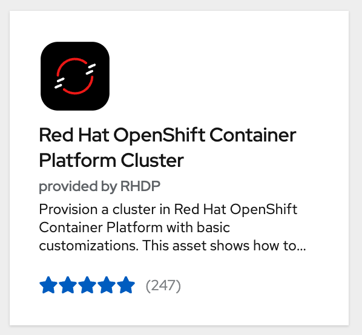
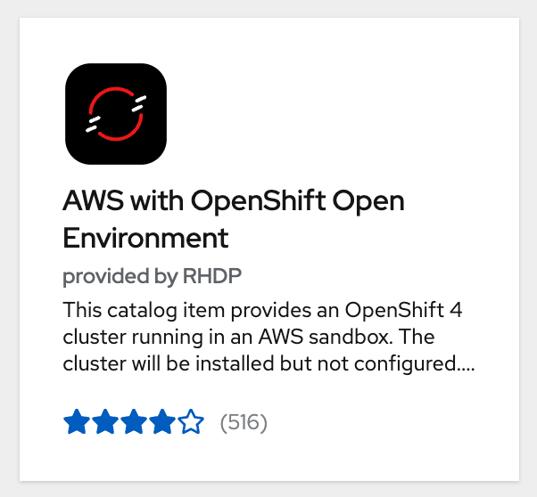
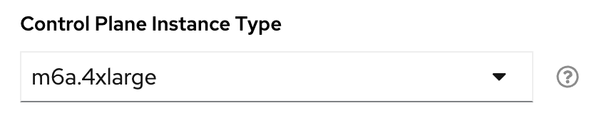

# Red Hat Demo Environment

This repo has been tested and maintained using the Red Hat Demo environment ([demo.redhat.com](https://demo.redhat.com)), which can be utilized for deploying internally for Red Hat employees.

Users can request the following catalog items to deploy these resources:

- Red Hat OpenShift Container Platform Cluster
- AWS with OpenShift Open Environment

## Red Hat OpenShift Container Platform Cluster

The Red Hat OpenShift Container Platform Cluster provisions nodes in a lab hosted by the Demo Platform team.  This catalog item is generally the cheapest and fastest option to provision a cluster.

This catalog option will support the non-GPU versions of the RHOAI deployment:

- rhoai-eus-2.8
- rhoai-fast

This catalog item does not have the ability to provision GPU resources.

## AWS with OpenShift Open Environment

The AWS with OpenShift Open Environment catalog item deploys an OpenShift cluster in AWS with the ability to provision additional nodes, including GPU nodes.

This catalog option will support all of the RHOAI deployment options.

When provisioning it is recommended to request the `m6a.4xlarge` Control Plane Instance Type:

Once provisioned, it is also recommended to scale the worker MachineSet to 2 in order to provision enough resources to run OpenShift AI and its dependencies.
