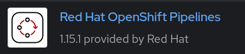
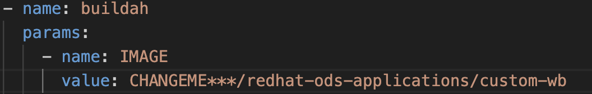
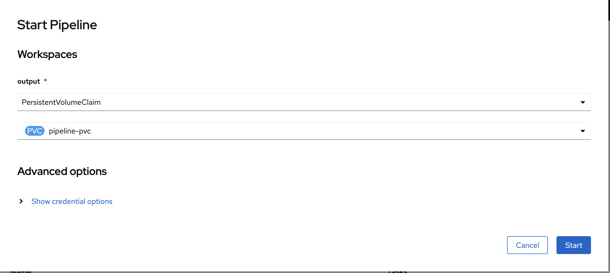
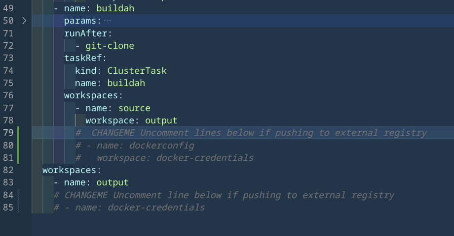
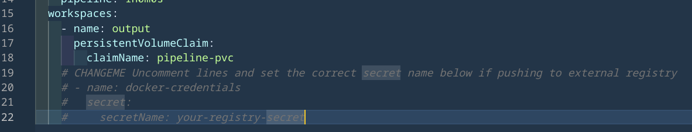
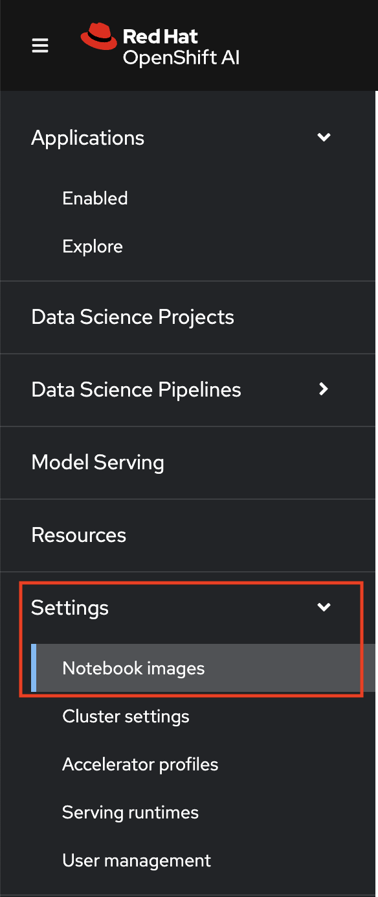
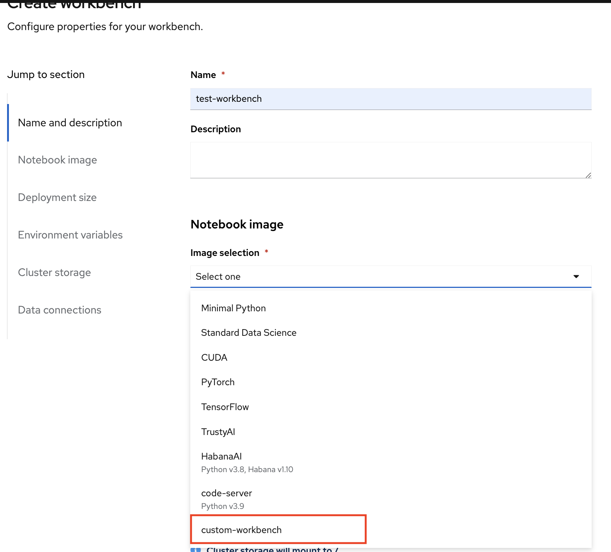

## Create a Custom Workbench Image for RHOAI

The Dockerfile uses an existing workbench image and installs new packages from the requirements.txt file.
The Openshift Tekton pipeline has two tasks: git-clone and buildah.

The first task git clones this repository so we can use the Dockerfile and the requirements.txt.
The second task uses buildah to build the Dockerfile (in this folder and uses the requirements.txt file) and pushes the container image to the openshift/external registry.

### To build the Custom Workbench Image using pipeline, follow the steps below

NOTE: Ensure that the `Red Hat Openshift Pipelines` operator is installed



#### To push the image to openshift registry:

1. Enable openshift image registry so we can push custom notebook image to OpenShift image registry.
(If using external registry, you can skip enabling and using the OpenShift internal registry)
2. Expose openshift image registry route.
`oc patch configs.imageregistry.operator.openshift.io/cluster --patch '{"spec":{"defaultRoute":true}}' --type=merge`

3. Get route:
`oc get route -n openshift-image-registry`

4. Change namespace:
`oc project redhat-ods-applications`

5. Create PVC for pipeline:
`oc apply -f pvc.yaml`

6. Change url to image registry url in buildah task in `pipeline.yaml`.


7. Apply pipeline.yaml and run pipeline.

Choose newly created PVC for pipeline.


#### To push the image to external registry:

1. Change namespace:
`oc project redhat-ods-applications`

2. Create PVC for pipeline:
`oc apply -f pvc.yaml`

3. Create a secret for the external registry

    ```oc create secret docker-registry \
    --docker-server=privateregistry.example.com \
    --docker-username=developer@example.com \
    --docker-password=******** \
    --docker-email=unused \
    private-registry```

4. Change url to external image registry url in buildah task in `pipeline.yaml`.


5. Uncomment commented `workspaces` lines in `pipeline.yaml` and `pipeline-run.yaml`.  
    

6. Apply pipeline.yaml and run pipeline.
    

7. You can also run the pipeline by applying `pipeline-run.yaml`. Change secret-name in the yaml.
    Be sure to change the name in the yaml to create new run.
    

### Import image in RHOAI Dashboard

1. Go into RHOAI dashboard.

2. Settings > Notebook Images > Import new image > Image location
    

    Enter image location. In Openshift > Builds > ImageStreams > Custom Workbench, we can get the location:
    `image-registry.openshift-image-registry.svc:5000/redhat-ods-applications/custom-wb`

    (If not using OpenShift internal registry, use external registry image location)

    

3. Create data science project.

4. Create workbench and choose your new custom notebook.


5. Launch workbench

Read More about it [here](https://ai-on-openshift.io/odh-rhoai/custom-notebooks/#install-python-packages)

GitHub to where the workbench images are created: [ODH Contrib - Workbench Images](https://github.com/opendatahub-io-contrib/workbench-images/tree/main)